+++
date = '2020-07-11T18:30:05+05:30'
draft = false
math = true
title = 'Experiments with DQN'
+++


## Theory

In tabular Q-learning, we maintain a table that contains the Q-values for all
the actions we can perform in a particular state. As the state space keeps
increasing, the space-complexity of tabular Q-learning increases as well and
after a certain point it becomes very inefficient. To solve this, we use a deep
neural network to estimate the Q-values. The deep neural network takes in the
current state as input and outputs the Q-values of the actions. We select the
action with the maximum Q-value. Since neural networks are good function
approximators, similar states will give us similar Q-values. In DQN instead of
updating a Q-table we update the parameters of the neural network to make better
predictions. The parameter updates are done by gradient descent $(target -
Q(current\_state))^2.$

The target of the loss function is given by 

```python
target  = r + DISCOUNT_FACTOR * np.amax(Q(next_state))
# np.amax: Numpy method that returns the maximum of an array or maximum along an axis.
```

### Limitations

1. The problem with this approach is that everytime we perform gradient-descent
   to update our neural network parameters, our targets will also be changing.
   Thus our neural network will try to converge to an unstable target and this
   will make the learning process very very unstable.

2. As the agent interacts in the environment, it collects experiences
   (current_state, action, next_state, reward) which are used to update the
   neural network weights. The problem with this is neural networks generalize
   over the input data. If the input data are highly correlated then the neural
   network will generalize over correlated data and the learning will be
   inefficient.

#### Solution for limitation 1

To solve the problem of a constantly changing target we use another Q-network
called Q-target to calculate the target values. As the agent interacts with the
environment, it uses the main Q-network to select the actions. After every
episode the main Q-network's weights are updated by gradient descent $$(target -
Q(\text{current\_state}))^2$$, where the $$target$$ is calculated from the
Q-target network. The Q-target network is updated to the weights of the
constantly updated main Q-network after long intervals to give the main
Q-network time to converge to a target. The interval after which the Q-target
network is updated is another hyperparameter that needs to be adjusted.

Another way we can update the Q-target network is through soft-updates. Here
everytime we update the Q-network, we update the weights of the Q-target
slightly towards the weight of the main Q-network. It can be represented as

```python
Q_target = (1 - TAU) * Q_Target + TAU * Q
# Q_target represents the target network Q-target
# Q represents the main Q-network
# 0 <= TAU < 1
# TAU is a hyperparameter that needs to be adjusted.
```

#### Solution for limitation 2

To solve the problem of correlated data we use an experience replay buffer. We
store all of our agent's experiences in the replay buffer. After a certain
amount of experiences have been stored, we randomly sample a mini-batch of
experiences and use that mini-batch to update the main Q-network parameters.

### DQN Architecture

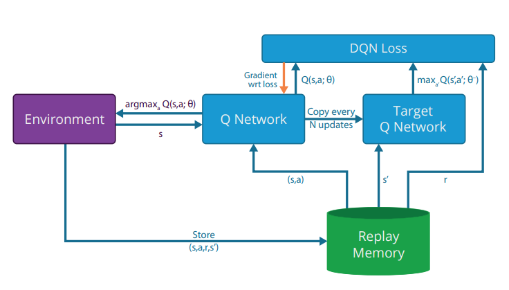

*Fig 1: DQN Architecture. Image source: [Nair, Arun, et al. "Massively parallel
methods for deep reinforcement learning."](https://arxiv.org/abs/1507.04296)*

### DQN Algorithm

```python
# Initialize replay memory D to capacity N.
# Initialize main Q-network (Q) with random weights.
# Initialize target Q-network (Q_target) with the same weights as that of Q.
for n_epi in range(total_episodes):
  done = False
  s = env.reset() # s represents the present state
  while not done:
    a = # sample action with epsilon-greedy approach
    # take the action in the environment and get the reward and the next state
    s_prime, r, done = env.step(a) 
    # insert the experiences in the replay buffer
    replay_buffer.put(s,a,r,s_prime,done) 
    s = s_prime
    if done:
      break
  mini_batch = # sample mini-batch from replay buffer.
  for s,a,r,s_prime, done in mini_batch:
    max_future_q = np.amax(q_target(s_prime))
    # np.invert(int(done)) returns 0 if done is True and 1 if done is False
    target = r + DISCOUNT_RATE*max_future_q*np.invert(int(done)) 
    current_q = q.predict(s) # current q_values for the actions
    # updating the q_value of the chosen action to that of the target q value
    current_q[0][a] = target 
    x.append(s)
    y.append(current_q)
  q.train(x,y)
  # If we are doing soft-updates of Q_targets, do it after every training step.
  # after c episodes hard update q_target. 
  if(n_epi % c == 0):
    q_target.set_weights(q.get_weights())
``` 

## Environment

For our environment we will be using OpenAI gym's CartPole-v1 environment.
Description of the environment from [OpenAI gym's
website](https://gym.openai.com/envs/CartPole-v1/) is as follows:
> A pole is attached by an un-actuated joint to a cart, which moves along a
> frictionless track. The system is controlled by applying a force of +1 or -1
> to the cart. The pendulum starts upright, and the goal is to prevent it from
> falling over. A reward of +1 is provided for every timestep that the pole
> remains upright. The episode ends when the pole is more than 15 degrees from
> vertical, or the cart moves more than 2.4 units from the center.

Each observation in our environment is an array of 4 numbers where each number
represents the cart position, cart velocity, pole angle and pole angular
velocity respectively. Example of an observation:

```
[-0.061586   -0.75893141  0.05793238  1.15547541]
```

Our action space consists of 2 discreete actions, left (0) and right (1).

## Code implementation

For implementing the algorithm, I used Tensorflow for writing the Q-network
which is a deep neural net. The Tensorflow version I am using is 2.2.0.

### The main function:

```python
if __name__=="__main__":

    BUFFERLIMIT = 50_000
    MINI_BATCH_SIZE = 256 
    HIDDEN_LAYERS = 2
    HIDDEN_LAYER_UNITS = 64
    LEARNING_RATE = 0.0005
    DISCOUNT_RATE  = 0.99 
    EPISODES = 1000
    UPDATE_TARGET_INTERVAL = 100  # target update interval for hard update
    TAU = 0.0001 # used when soft update is used
    # Set to True if you want to do soft update instead of hard update
    soft_update = True 
    #############################################    
    # select environment. Currently only tested on CartPole-v1
    env = gym.make("CartPole-v1") 
    #############################################
    # create the main Q-network, the target network Q-target 
    # and the experience replay buffer
    input_shape = env.observation_space.shape[0] # input shape for the neural net
    output_shape = env.action_space.n # output shape for the neural net
    q = Qnet(
        hidden_layers = HIDDEN_LAYERS, 
        observation_space = input_shape, 
        action_space = output_shape, 
        learning_rate = LEARNING_RATE, 
        units = HIDDEN_LAYER_UNITS
        ) # the main Q-network
    q_target = Qnet(
        hidden_layers = HIDDEN_LAYERS, 
        observation_space = input_shape, 
        action_space = output_shape, 
        learning_rate = LEARNING_RATE, 
        units = HIDDEN_LAYER_UNITS
        ) # the target network Q-target
    # initializing Q-target weights to the weights of the main Q-network
    q_target.model.set_weights(q.model.get_weights()) 
    memory = ReplayBuffer(bufferlimit = BUFFERLIMIT) # Experience Replay Buffer
    #############################################
    for n_epi in range(EPISODES+1):
        epsilon = max(0.01, (0.99 - 0.98/200*n_epi))
        s = env.reset()
        done = False
        score = 0.
        #############################################
        while not done:
            #select action from updated q net
            a = q.sample_action(tf.constant(s,shape=(1,input_shape)), epsilon) 
            s_prime, r, done, info = env.step(a)
            # insert into experience replay
            memory.put((s,a,r,s_prime,int(done))) 
            s = s_prime
            score += r
            if done:
                break
        #############################################
        if(memory.size() >= 1000):
            q.train(q_target, memory, MINI_BATCH_SIZE)  # update main Q-network
            # update target network Q-target
            q_target.update_weight(q, ep_num=n_epi, update_interval=UPDATE_TARGET_INTERVAL, tau=TAU, soft=soft_update) 

```

### The replay buffer class:

For the replay buffer we are using a dequeue. The replay buffer class should
contain a method to insert the experience data into the dequeue, a method to
return the present size of the buffer and a method to sample from the buffer and
return a mini-batch of experiences.

```python
class ReplayBuffer: # Replay buffer class
    def __init__(self, bufferlimit):
        self.bufferlimit = bufferlimit
        self.buffer = collections.deque(maxlen= self.bufferlimit)

    def put(self, transition):
        '''
        Function used to insert experiences in the experience replay buffer
        '''
        if(self.size() >= self.bufferlimit):
            self.buffer.pop()
        self.buffer.append(transition)

    def sample(self, mini_batch_size=32):
        '''
        Function used to randomly sample MINI_BATCH_SIZE of experiences from the experience replay buffer.
        '''
        mini_batch = random.sample(self.buffer, min(len(self.buffer), mini_batch_size))
        return mini_batch
        
    def size(self):
        '''
        Returns the total size of the experience replay buffer.
        '''
        return len(self.buffer)
```

### The DQN class:

For the DQN class we will be using a 3 layered neural network. The number of
nodes in the input layer is the same as the observation space and the number of
nodes in the output layer is the same as the action space. The activation
functions of the first two hidden layers are relu and the activation function of
the output layer is linear. The optimizer used is Adam and the loss function is
mean squared error. 

The DQN class must contain a method to sample actions based on the
epsilon-greedy approach, a method to train the main Q-network and a method to
update the weights of the Q-target network.

```python
class Qnet: # Q-network class
    def __init__(self, hidden_layers = 2, observation_space = 4, action_space = 2, learning_rate = 0.0001, units = 64):
        '''
        creates the model of the neural network with the given hyperparameters.
        '''
        self.input_shape = observation_space
        self.output_shape = action_space
        self.learning_rate = learning_rate
        self.units = units
        self.model = tf.keras.models.Sequential()
        # 1st hidden layer
        self.model.add(tf.keras.layers.Dense(self.units, input_shape=(self.input_shape,), activation = "relu")) 
        for i in range(hidden_layers-1): # create the rest of the hidden layers
            self.model.add(tf.keras.layers.Dense(self.units, activation = "relu"))
        self.model.add(tf.keras.layers.Dense(self.output_shape, activation = "linear")) # create output layer
        self.model.compile(optimizer =tf.keras.optimizers.Adam(lr=self.learning_rate), loss="mse")
    
    def train(self,q_target,replay,mini_batch_size=32):
        '''
        Function to train the main Q-network.
        '''
        mini_batch = replay.sample(mini_batch_size) 
        x = []
        y = []
        for s,a,r,s_prime,done in mini_batch:
            max_future_q = np.amax(q_target.model.predict(tf.constant(s_prime,shape=(1,self.input_shape))))
            # calculate target using Q-target
            target = r + DISCOUNT_RATE*max_future_q*np.invert(done) 
            # current q_values for the actions
            current_q = self.model.predict(tf.constant(s,shape=(1,self.input_shape))) 
            # updating the q_value of the chosen action to that of the target q value
            current_q[0][a] = target 
            x.append(s)
            y.append(current_q)
        x = tf.constant(x,shape=(len(x), self.input_shape))
        y = tf.constant(y, shape=(len(y), self.output_shape))
        self.model.fit(x,y)

    def update_weight(self, q, ep_num, update_interval = 100, tau = 0.0001, soft=True):
        '''
        Function to update the weights of the target network Q-target.
        '''
        if soft == False:
            # perform hard update on the target network
            if(ep_num % update_interval == 0):
                target_theta = q.model.get_weights()
                self.model.set_weights(target_theta)
                print("Target Update")
        else:
            # perform soft update on the target network
            q_theta = q.model.get_weights()
            target_theta = self.model.get_weights()
            counter = 0
            for q_weight, target_weight in zip(q_theta,target_theta):
                target_weight = target_weight * (1-tau) + q_weight * tau
                target_theta[counter] = target_weight
                counter += 1
            self.model.set_weights(target_theta)
    
    def sample_action(self, obs, epsilon):
        '''
        Function to select an action depending on the observation using epsilon greedy approach.
        '''
        coin = random.random()
        if(coin<=epsilon):
            return random.randint(0, 1) # returns values between 0 and 1
        else:
            return np.argmax(self.model.predict(obs))
```

## Experiments

**Goals:**

1. To see how the performance of DQN changes as the hyperparameters related to
   the target network Q-target are varied. 

2. To see how the performance of DQN changes as the number of hidden layers is
   varied. 

**Experimental setup:** 

- Each experiment will be run for 1000 episodes. 

- *Validation Experiment*: For the experiments where the performance seems to be
  improving, a validation experiment will be run with a different random seed
  value to get a different weight initialization for the neural networks. If the
  performance improves for one random seed value, it should improve for other
  random seed values as well.

- In all experiments except experiment 5, the neural network will have two
  hidden layers each of size 64. 

- In each experiment, the epsilon will go from 0.99 to 0.01 in the first 200
  episodes and the training will start only when the replay buffer contains a
  minimum of 1000 experiences. 

- The agent's performance after every 10 episodes of training will be tested on
  a seperate test environment where the agent will be run for 10 episodes and
  it's mean reward will be used to determine the performance. 

- All the plots will be smoothened to show the trend of the performance. The
  smoothening formula I have used is: 

```python
score[i] = beta * score[i-1] + (1 - beta) * score[i] 
# 0 <= beta < 1. 
# For our experiments, beta = 0.88
```

- Each experiment will be repeated with the MINI_BATCH_SIZE changed to see how
  the DQN agent's performance varies in that experiment when the MINI_BATCH_SIZE
  varies. 

- Hyperparameters that stay constant throughout all experiments:

```python
BUFFERLIMIT = 40_000
LEARNING_RATE = 0.0005
DISCOUNT_RATE  = 0.99  
NUMBER_OF_UNITS = 64 # number of units in each hidden layer
```

---
<br>
**Hypothesis for MINI_BATCH_SIZE:** 

As the MINI_BATCH_SIZE is increased, the performance for that particular
experiment will become better. The reason being the MINI_BATCH_SIZE is the
number of training data that will be randomly sampled from the experience replay
buffer and used to train our neural network. If the training data size
increases, the neural network will be able to learn better and also the chances
of training on the same data will increase which will lead to a better learning.

Each experiment will be run for the following values of MINI_BATCH_SIZE:

```python
MINI_BATCH_SIZE = 32 64 128 256
```

---
<br>
### Experiment 1: No seperate target network<sup>[1]</sup>

In this experiment we will not use a seperate target network but will use the
same main Q-network to calculate the target values for training our neural net.
The training function without a seperate target network looks like this.

```python
def train(self,replay,mini_batch_size=32):
        mini_batch = replay.sample(mini_batch_size)
        x = []
        y = []
        for s,a,r,s_prime,done in mini_batch:
            max_future_q = np.amax(
                self.model.predict(tf.constant(s_prime,shape=(1,self.input_shape))))
            target = r + DISCOUNT_RATE*max_future_q*np.invert(done)
            # current q_values for the actions
            current_q = self.model.predict(tf.constant(s,shape=(1,self.input_shape))) 
            # updating the q_value of the chosen action to that of the target q value
            current_q[0][a] = target 
            x.append(s)
            y.append(current_q)
        x = tf.constant(x,shape=(len(x), self.input_shape))
        y = tf.constant(y, shape=(len(y), self.output_shape))
        self.model.fit(x,y)
```

**Hypothesis:** 

Since the targets are being calculated using the same neural network, they keep
on changing leading to a very unstable learning as the neural network never
converges towards a fixed target.

**Observation:**

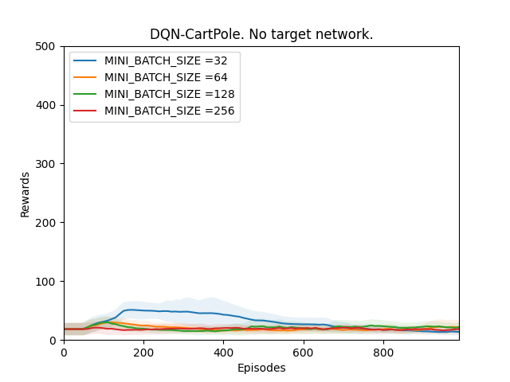

*Plot 1: Rewards vs Episodes plot to show the performance of the DQN agent when
there is no target network.*

**Conclusion:**

From the observations we can see that the DQN performance never converges. It is
because since we are calculating the targets using the main Q-network which
constantly keeps on changing, our main Q-network is constantly chasing a
fluctuating target. This results in our main Q-network never being able to
converge and thus never improves the DQN agent's performance.

---
<br>
### Experiment 2. Seperate target network but not updated

In this experiment, a seperate target network Q-target is used. In the begining,
Q-target is initialized to the weights of the main Q-network, but it is never
updated. The main Q-network converges towards the targets generated by this
constant target network Q-target.

**Hypothesis:**

The target network Q-target is initialized to the weights of the main Q-network
and the weights never changes. This means that the main Q-network in every
training step will try to converge towards targets generated by itself when it
was first initialized. This means that the performance will stop improving after
a certain time as the Q network will be converging towards it's initial
condition.

**Observation 1:**

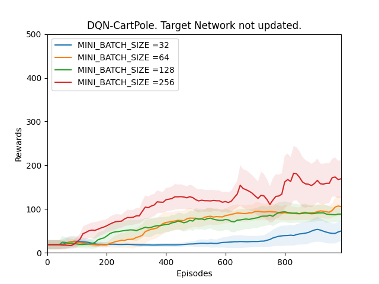

*Plot 2_a: Rewards vs Episodes plot to show the performance of the DQN agent
when the target network is not updated.*

**Conclusion 1:**

The observation does not support the hypothesis. Theoritically, the main
Q-network is converging towards a target that is being calculated by a target
network Q-target which is the same as the main Q-network when it was first
initialized. The performance should't be improving however from our observation
it is evident that the performance is improving. One reason for this might be
that the weights that have been randomly initialized in the beginning of the
training were good enough.

To confirm this a validation experiment is run. From Observation 1 it is clear
that as the MINI_BATCH_SIZE keeps increasing the performance improves quicker so
in this experiment I will use only one MINI_BATCH_SIZE. While bigger
MINI_BATCH_SIZE improves performance, it also needs more time to train the
neural network. Therefore I will be using a MINI_BATCH_SIZE of 64.

**Observation 2:**

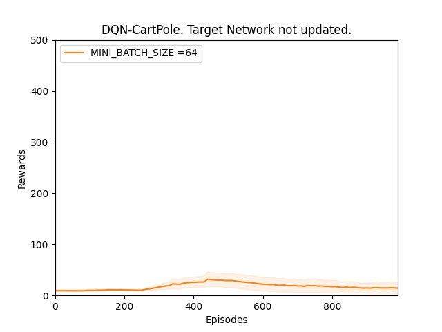

*Plot 2_b: Rewards vs Episodes plot to show the performance of the DQN agent
with different random seed value when the target network is not updated.*

**Conclusion 2:**

Observation 2 supports our hypothesis that our main Q-network will try to
converge towards targets generated by the target network Q-target which is the
same as the main Q-network when it was first initialized and thus the
performance of the DQN agent will not be optimal. This means that in observation
1 the performance seemed to be improving because the random weights with which
the neural networks were initialized were good enough.

---
<br>
### Experiment 3. Hard update the target network<sup>[2]</sup>

In this experiment, the target network Q-target is updated to the weights of the
main Q-network after UPDATE_TARGET_INTERVAL number of episodes. Here
UPDATE_TARGET_INTERVAL is a hyperparameter. Performance of the DQN agent will be
tested over the following values of UPDATE_TARGET_INTERVAL:

```python
UPDATE_TARGET_INTERVAL = 20 50 100 200
```

**Hypothesis:**

If UPDATE_TARGET_INTERVAL is too small, the target network Q-target will change
too quickly which will lead to an unstable network. If UPDATE_TARGET_INTERVAL is
too big the main Q-network will keep trying to converge towards targets
generated by a very old target network Q-target which might lead to poor
performance. 

**Observations 1:**

*Note: The dotted black vertical lines in the plots represents the positions
where the target network is updated.*

**1. UPDATE_TARGET_INTERVAL = 20**


*Plot 3_a: Rewards vs Episodes plot to show the performance of the DQN agent
when the target network is hard updated with UPDATE_TARGET_INTERVAL = 20.*

**2. UPDATE_TARGET_INTERVAL = 50**

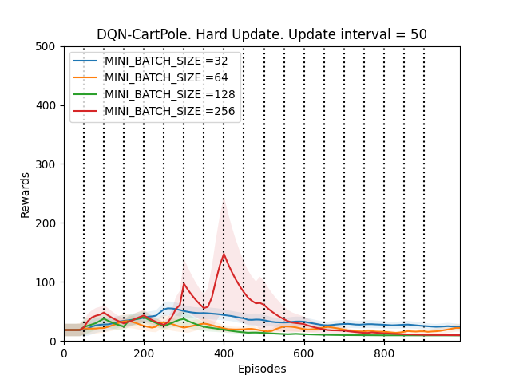

*Plot 3_b: Rewards vs Episodes plot to show the performance of the DQN agent
when the target network is hard updated with UPDATE_TARGET_INTERVAL = 50.*

**3. UPDATE_TARGET_INTERVAL = 100**

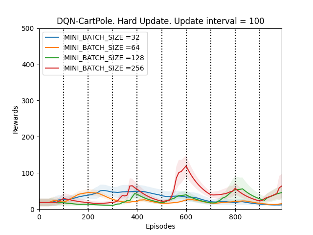

*Plot 3_c: Rewards vs Episodes plot to show the performance of the DQN agent
when the target network is hard updated with UPDATE_TARGET_INTERVAL = 100.*

**4. UPDATE_TARGET_INTERVAL = 200**


*Plot 3_d: Rewards vs Episodes plot to show the performance of the DQN agent
when the target network is hard updated with UPDATE_TARGET_INTERVAL = 200.*

**Conclusion 1:**

The first thing that is observed is that the performance of the DQN agent might
improve or deteriorate whenever the target network is updated. The DQN agent
seems to perform the best when the UPDATE_TARGET_INTERVAL is 100, otherwise the
fluctuations in the performance are too much. This supports our hypothesis.

To confirm this, we run a validation experiment with UPDATE_TARGET_INTERVAL =
100 for MINI_BATCH_SIZE = 256 since the DQN agent seems to perform the best for
batch sizes 128 and 256. 

**Observation 2:**

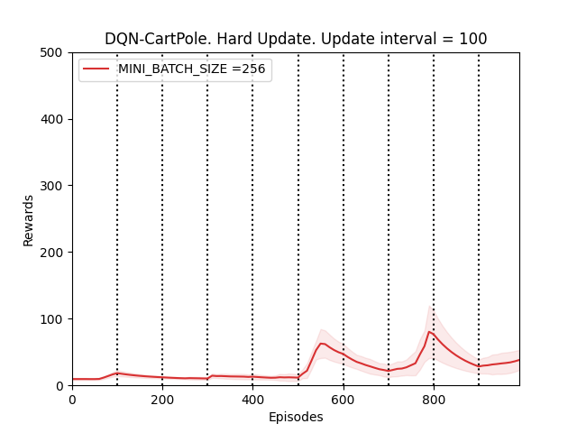

*Plot 3_e: Rewards vs Episodes plot to show the performance of the DQN agent
under a different random seed value when the target network is hard updated with
UPDATE_TARGET_INTERVAL = 100.*

**Conclusion 2:**

Observation 2 validates conclusion 1 and thus our hypothesis. From observation 2
we notice that the performance of the DQN agent does become better over time but
because of hard updating the target netowrk Q-target, the performance fluctuates
a lot.

---
<br>
### Experiment 4. Soft update target network<sup>[3]</sup>

In this experiment the target network Q-target is updated by a tiny amount every
time the main Q-network is trained. The tiny amount by which the target network
is updated is determined by TAU. Here TAU is a hyperparameter.  The soft update
formula is given by: 

```python
Q_target = (1 - TAU) * Q_Target + TAU * Q
# Q_target represents the target Q network
# Q represents the main Q network
# 0 <= TAU < 1
# TAU is a hyperparameter that needs to be adjusted.
```

 Performance of the DQN agent will be tested over the following values of TAU:

```python
TAU = 0.1, 0.01, 0.001, 0.0001
```

**Hypothesis:**

The smaller the value of TAU, the closer the updated target network will be to
the old target network. Although the target network weights will change
constantly, the changes will be very small and thus will lead to a more stable
performance.

**Observations 1:**

**1. TAU = 0.1**

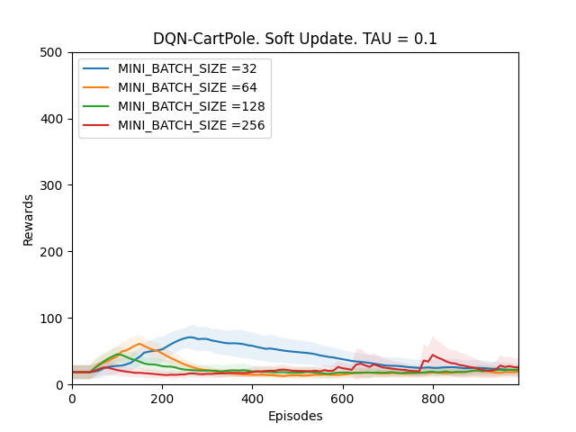

*Plot 4_a: Rewards vs Episodes plot to show the performance of the DQN agent
when the target network is soft updated with TAU = 0.1.*

**2. TAU = 0.01**

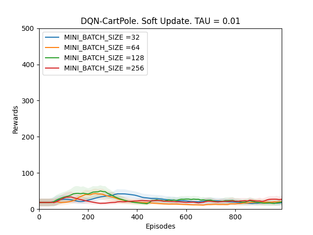

*Plot 4_b: Rewards vs Episodes plot to show the performance of the DQN agent
when the target network is soft updated with TAU = 0.01.*

**3. TAU = 0.001**

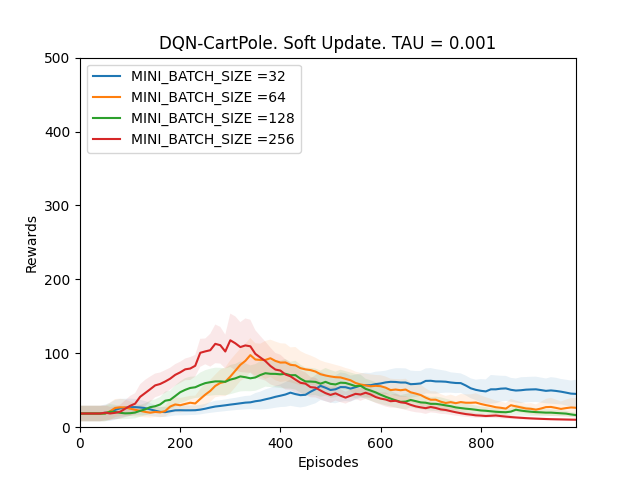

*Plot 4_c: Rewards vs Episodes plot to show the performance of the DQN agent
when the target network is soft updated with TAU = 0.001.*

**4. TAU = 0.0001**


*Plot 4_d: Rewards vs Episodes plot to show the performance of the DQN agent
when the target network is soft updated with TAU = 0.0001.*

**Conclusion 1:**

From Observations 1, it can be seen that the DQN performance never converges
when TAU is between 0.1 and 0.001. It is because since the target network
Q-target is updated every time the main Q-network is trained; if the changes in
the target network are big, the main Q-network will be converging towards a
constantly fluctuating target thus making the model unstable. However, when the
value of TAU is 0.0001, the performance of the DQN agent improves. It is because
even though Q-target is updated frequently, it is changing by very very small
amounts, which is why the main Q-network is converging towards an almost
constant target and thus the model slowly stabilizes over time and the
performance improves.

Conclusion 1 is confirmed by running a validation experiment with TAU = 0.0001
for MINI_BATCH_SIZE of 64 as it will take less time to train using a smaller
MINI_BATCH_SIZE.

**Observation 2:**

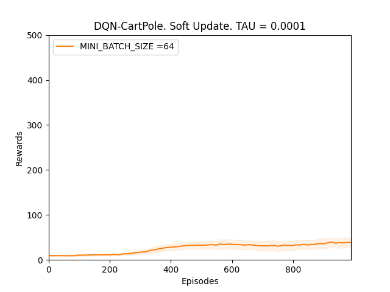

*Plot 4_e: Rewards vs Episodes plot to show the performance of the DQN agent
under a different seed value when the target network is soft updated with TAU =
0.0001.*

**Conclusion 2:**

From Observation 2, we can see that the DQN performance improves slowly. Even
though in this random seed value the improvements are slow but they do trend
upwards thus validating conclusion 1.

---
<br>

**Conclusion for MINI_BATCH_SIZE hypothesis:**

In all of the above experiments, for all the hyperparameter values for which the
performance of our DQN agent improves, we notice that the improvement in the
performance is faster when the MINI_BATCH_SIZE is bigger. From our observations,
a MINI_BATCH_SIZE of either 128 or 256 will almost always make our model
converge faster. However one thing that needs to be kept in mind is that as the
MINI_BATCH_SIZE keeps increasing, the time taken to train the neural network
keeps on increasing as well.

---
<br>

### Experiment 5: Increase the number of hidden layers

In this experiment, the number of hidden layers is increased while keeping the
NUMBER_OF_UNITS constant. Each hidden layer will use the ReLU activation
function. From all the above experiments we will take only those hyperparameter
values that lead to the best performance of the DQN agent. We notice that the
DQN agent performs better and in a more stable way if we perform soft updates
with TAU = 0.0001. While performing soft updates, we noticed that as the
MINI_BATCH_SIZE increases, the performance improves quickly, so we will be using
a MINI_BATCH_SIZE of 256 here along with soft updating the target network with
TAU = 0.0001.

We will be using the following number of hidden layers:

```python
HIDDEN_LAYERS = 1, 2, 3, 4
```

**Hypothesis:**

Increasing the number of hidden layers should improve the performance but after
a certain number of hidden layers the model will start overfitting which in turn
will lead to poor performance.

**Observations 1:**


*Plot 5_a: Rewards vs Episodes plot to show the performance of the DQN agent
when the number of hidden layers is varied.*

**Conclusion 1:**

We start with 1 hidden layer and keep increasing till 4 hidden layers. The
performance of the DQN agent improves till there are 2 hidden layers but
degrades significantly after that. This supports our hypothesis but to confirm
it we will run a validation experiment with 2 hidden layers to see if the
performance improves under a different seed value as well.

**Observations 2:**

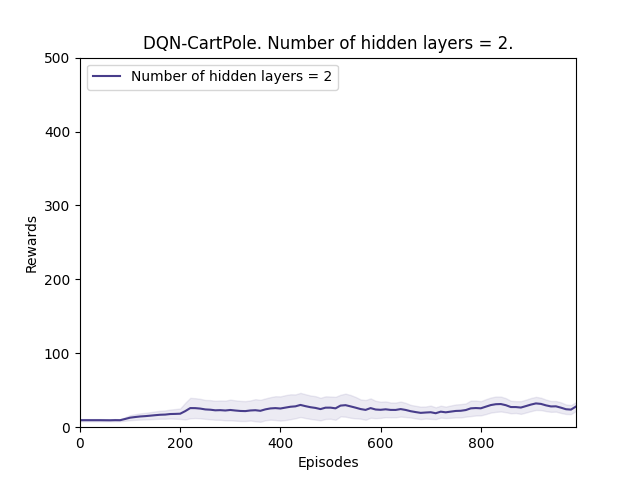

*Plot 5_b: Rewards vs Episodes plot to show the performance of the DQN agent
under a different random seed value when the number of hidden layers is 2.*

**Conslusion 2:**

From observation 2, we see that the performance does improve even though the
improvement is low thus validating conclusion 1.

---
<br>

## Conclusion

From all the above experiments the following conclusions are drawn:

1. If there is no seperate target network, DQN performance is very unstable and
   never converges.

2. If the seperate target network Q-target is never updated, DQN performance
   will never converge and will stagnate over time.

3. When hard updating the target network Q-target, if the update interval is too
   small, DQN performance becomes very unstable. If the update interval is too
   big, the DQN performance will be poor as well. The update interval needs to
   be such that the target weights changes slowly but not too slowly.

4. If we are soft updating the target network Q-target, the soft target
   parameter TAU should be as small as possible so that the target weights
   changes by very tiny amount.

5. While updating the target weights, soft updating works better than hard
   updating as it leads to a more stable performance improvement.

6. As the mini batch size keeps increasing, the performance improves quicker but
   the training time increases as well.

7. The DQN performance improves when the number of hidden layers is increased
   but till a certain amount. After that, the performance degrades due to
   overfitting. For our experiment, the optimal number of hidden layers was 2.

Considering the above conclusions, the DQN agent is trained one final time by
using the following hyperparameter values: 

```python
BUFFERLIMIT = 50_000
MINI_BATCH_SIZE = 256 
HIDDEN_LAYERS = 2
HIDDEN_LAYER_UNITS = 64
LEARNING_RATE = 0.0005
DISCOUNT_RATE  = 0.99 
EPISODES = 2000
TAU = 0.0001 # Soft updating the target network Q-target
```

**Observation:**

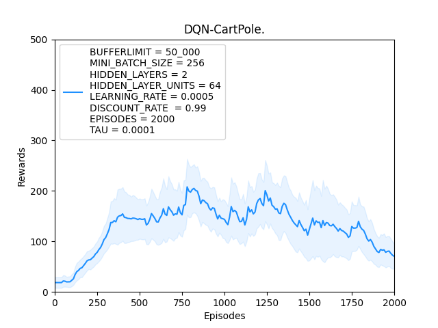

Using the appropriate hyperparameters will definitely make the performance of
DQN better, however as we can see from the above plot, DQN performs in a very
unstable way and it will take a lot of training for the agent to eventually
perform optimally.

The instability in DQN is mainly due to the constantly changing target. Even
though the changes in the target weights are tiny, the loss function is always
fluctuating and it takes a lot of time for the DQN agent to reach to a point
where the fluctuation in the loss function is less. 


The full working code can be found [here](https://github.com/kaustabpal/RL_algorithms).

## References

[1] [Mnih et al. "Playing atari with deep reinforcement
learning."](https://arxiv.org/abs/1312.5602)

[2] [Mnih et al. "Human-level control through deep reinforcement
learning."](https://www.deepmind.com/publications/human-level-control-through-deep-reinforcement-learning")

[3] [Lillicrap et al. "Continuous control with deep reinforcement
learning."](https://arxiv.org/abs/1509.02971)
