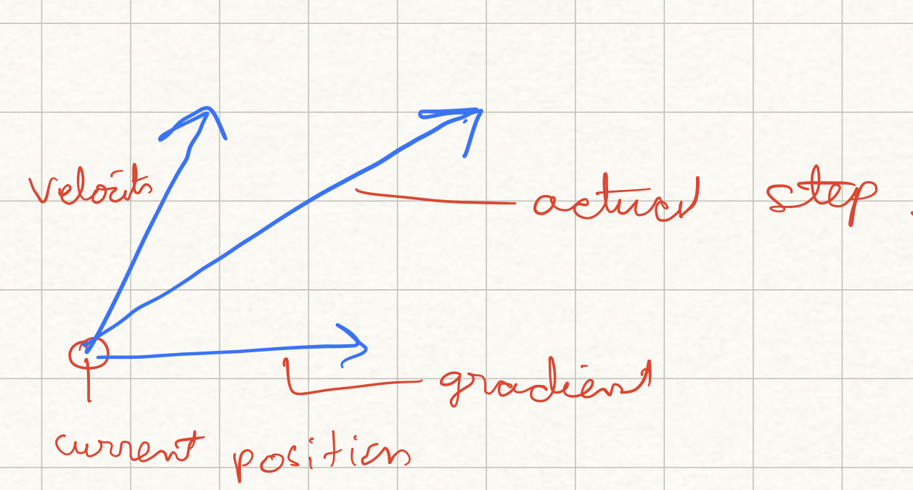

+++
date = '2025-12-12T19:37:19+05:30'
draft = true
math = true
title = 'Neural Networks: Optimizer'
url = '/optimizer'
+++

How do we find the best parameters $W$ for our model that minimizes the loss function $L(W)$?

If $L(W)$ is the loss function , the gradient of the loss with respect to $W$ will tell us the direction in which the slope of the loss function is steepest. If we go in the opposite direction of the gradient, we will be moving in the direction of steepest descent. 

## Adjacency Matrix

Hello World. How are you. This is a test. Symmetric Matrix. Hello

## Gradient Descent

Here we iteratively move in the direction of the negative gradient of the loss function to find the minimum of the loss function. 

$$
W_{i+1} = W_i - \alpha \nabla_W L(W)
$$

where $\alpha$ is the learning rate. 

The hypermaters are:

1. **Weight initialization**: How we initialize the weights determine which local minima we converge to.

2. **Number of iterations**: The number of iterations determine how many times we update the weights.

3. **Learning rate**: The learning rate determine how much we update the weights.

### Batch Gradient Descent

In batch gradient descent, we compute the gradient of the loss function with respect to the weights using the entire dataset. This is the most common and simplest form of gradient descent.

$$
\begin{align}
L(W) &= \frac{1}{N} \sum_{i=1}^N L_i(x_i, y_i,W) \\
\nabla_W L(W) &= \frac{1}{N} \sum_{i=1}^N \nabla_W L_i(x_i, y_i,W)
\end{align}
$$

If $N$ is too large then the gradient is computed using the entire dataset which is computationally expensive. 

### Stochastic Gradient Descent

Here we calculate the loss and the gradient of the loss on a mini-batch of the entire dataset. Typical minibatch size are 32, 64, 128. Think of the mini-batch as data sampled from a larger distribution. The loss is then computed as the expectation over the full-distribution.

Problems with SGD:

1. If the step size is too large the progress jitters along the steep direction. If the step size is too small the algorithm converges extremely slowly.

2. SGD often also gets stuck in local minima or saddle points.

3. Since the gradients come from mini-batches they are a bit noisy.

## SGD with Momentum

Read: [On the importance of initialization and momentum in deep learning](https://proceedings.mlr.press/v28/sutskever13.pdf)

This tackles the problems of SGD. Here we build up a velocity of running mean of gradients and use it to update the weights.

$$
\begin{array}{|l|l|}
\hline
\textbf{SGD} & \textbf{SGD + Momentum} \\
\hline
x_{t+1} = x_t - \alpha \nabla_x L(x_t) & v_{t+1} = \rho v_t +\nabla f(x_t)\\
 & x_{t+1} = x_t - \alpha v_{t+1} \\
 & \text{start with } v_t = 0 \\
 & \text{Typically $\rho = 0.9$ or $0.99$ } \\
\hline
\end{array}
$$

Momentum helps solve the problem of local minima as in a local minima the gradient may be $0$ but thee might still be some velocity to carry us to the other side. Also the gradients are less noisy. 

### Nesterov Momentum

Here we lookahead to the point where updating the weights using the velocity would take us, i.e. $W_t + \rho V_t$. From this point we compute the gradient and mix it with the velocity to get the actual update direction.
$$
V_{t+1} = \rho V_t + \nabla f(W_t + \rho V_t) \\
W_{t+1} = W_t - \alpha V_{t+1}
$$

## Adagrad

Read: [Adaptive Subgradient Methods for Online Learning and Stochastic Optimization](https://www.jmlr.org/papers/v12/duchi11a.html)

Overcomes the problesm of SGD in a different way. 

$$ 
\begin{align}
dw &= \nabla L(w) \\
grad^2 &= grad^2 + (dw)^2 \\
w_{t+1} &= w_t - \alpha \times \frac{dw}{(\sqrt{grad^2} + \epsilon)}
\end{align}
$$

if the gradient is changing very fast adagrad will divide by a large value so the progress will be damped down. If the grad is changing very slowly then the denominator will be small and the progress will be amplified.

The problem with adagrad is that we keep accumulating the gradient squared in the sum. This means that the denominator will keep increasing and the learning rate will keep decreasing. It might be possible that the $\frac{1}{sum}$ term might become so small that it might be zero even before we reach the minima. To solve this issue, we have RMSProp.

## RMSProp: Leaky Adagrad

$$
\begin{align}
dw &= \nabla L(w) \\
grad^2 &= \rho grad^2 + (1-\rho)(dw)^2 \\
w_{t+1} &= w_t - \alpha \times \frac{dw}{(\sqrt{grad^2} + \epsilon)}
\end{align}
$$

## Adam (RMSProp + Momentum)

$$
\begin{align}
moment_1 &= 0\\
moment_2 &= 0\\
dw &= \nabla L(w_t) \\
moment_1 &= \beta_1 \times moment_1 + (1-\beta_1)dw \\
moment_2 &= \beta_2 \times moment_2 + (1-\beta_2)dw^2 \\
w_{t+1} &= w_t - \alpha \frac{moment_1}{\sqrt{moment_2} + \epsilon}
\end{align}
$$

The problem with Adam is that if $\beta_2$ is very very close to $1$ then at $t=0$ we will be dividing by a very small number and as a result the update step might be extremely large. To solve for this we use a bias correction step in Adam. 

$$
\begin{align}
moment_1 &= 0\\
moment_2 &= 0\\
dw &= \nabla L(w_t) \\
moment_1 &= \beta_1 \times moment_1 + (1-\beta_1)dw \\
moment_2 &= \beta_2 \times moment_2 + (1-\beta_2)dw^2 \\
unbiased_moment_1 &= \frac{moment_1}{1-\beta_1^t} \\
unbiased_moment_2 &= \frac{moment_2}{1-\beta_2^t} \\
w_{t+1} &= w_t - \alpha \frac{unbiased_moment_1}{\sqrt{unbiased_moment_2} + \epsilon}
\end{align}
$$

Usually $\beta_1 = 0.9$ and $\beta_2 = 0.999$.

## Second order optimization

We don't do this often because if we want to do the second order optimization we do to perfomr second order taylor's approximation and as a result compute the hessian matrix. This is computationally expensive. And inverting an Hessian matrix is even more expensice.

